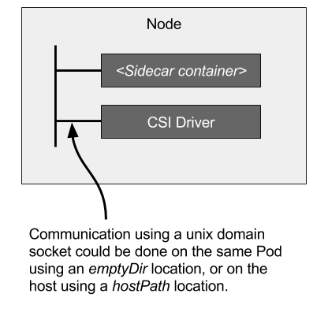
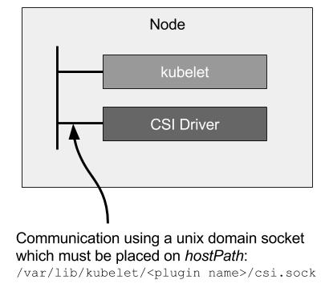

# Deploying in Kubernetes
This page describes to CSI driver developers how to deploy their driver onto a Kubernetes cluster.

## Overview
There are three components plus the kubelet that enable CSI drivers to provide storage to Kubernetes. These components are sidecar containers which are responsible for communication with both Kubernetes and the CSI driver, making the appropriate CSI calls for their respectful Kubernetes events.

## Sidecar Containers
[](https://docs.google.com/a/greatdanedata.com/drawings/d/1JExJ_98dt0NAsJ7iI0_9loeTn2rbLeEcpOMEvKrF-9w/edit?usp=sharing)

Sidecar containers manage Kubernetes events and make the appropriate calls to the CSI driver. These are the _external attacher_, _external provisioner_, and the _driver registrar_.

### External Attacher
[external-attacher](https://github.com/kubernetes-csi/external-attacher) is a sidecar container that watches Kubernetes _VolumeAttachment_ objects and triggers CSI _ControllerPublish_ and _ControllerUnpublish_ operations against a driver endpoint. As of this writing, the external attacher does not support leader election and therefore there can be only one running per CSI driver.  For more information please read [_Attaching and Detaching_](https://github.com/kubernetes/community/blob/master/contributors/design-proposals/storage/container-storage-interface.md#attaching-and-detaching).

Note, even though this is called the _external attacher_, its function is to call the CSI API calls _ControllerPublish_ and _ControllerUnpublish_. These calls most likely will occur in a node which is _not_ the one that will mount the volume. For this reason, many CSI drivers do not support these calls, instead doing the attach/detach and mount/unmount both in the CSI _NodePublish_ and _NodeUnpublish_ calls done by the kubelet at the node which is supposed to mount.

### External Provisioner
[external-provisioner](https://github.com/kubernetes-csi/external-provisioner) is a Sidecar container that watches Kubernetes _PersistentVolumeClaim_ objects and triggers CSI _CreateVolume_ and _DeleteVolume_ operations against a driver endpoint. For more information please read [_Provisioning and Deleting_](https://github.com/kubernetes/community/blob/master/contributors/design-proposals/storage/container-storage-interface.md#provisioning-and-deleting).

### Driver Registrar
[driver-registrar](https://github.com/kubernetes-csi/driver-registrar) is a sidecar container that registers the CSI driver with kubelet, and adds the drivers custom NodeId to a label on the Kubernetes Node API Object. It does this by communicating with the _Identity_ service on the CSI driver and also calling the CSI _GetNodeId_ operation. The driver registrar must have the Kubernetes name for the node set through the environment variable `KUBE_NODE_NAME` as follows:

```yaml
        - name: csi-driver-registrar
          imagePullPolicy: Always
          image: quay.io/k8scsi/driver-registrar:v0.2.0
          args:
            - "--v=5"
            - "--csi-address=$(ADDRESS)"
          env:
            - name: ADDRESS
              value: /csi/csi.sock
            - name: KUBE_NODE_NAME
              valueFrom:
                fieldRef:
                  fieldPath: spec.nodeName
          volumeMounts:
            - name: socket-dir
              mountPath: /csi
```

### Kubelet
[](https://docs.google.com/a/greatdanedata.com/drawings/d/1NXaVNDh3mSDhog7Q3Y9eELyEF24F8Z-Kk0ujR3pyOes/edit?usp=sharing)

The Kubernetes kubelet runs on every node and is responsible for making the CSI calls _NodePublish_ and _NodeUnpublish_. These calls mount and unmount the storage volume from the storage system, making it available to the Pod to consume. As shown in the _external-attacher_, most CSI drivers choose to implement both their attach/detach and mount/unmount calls in the _NodePublish_ and _NodeUnpublish_ calls. They do this because the kubelet makes the request on the node which is to consume the volume.

### Mount point
The mount point used by the CSI driver must be set to _Bidirectional_. See the example below:

```yaml
          volumeMounts:
            - name: socket-dir
              mountPath: /csi
            - name: mountpoint-dir
              mountPath: /var/lib/kubelet/pods
              mountPropagation: "Bidirectional"
      volumes:
        - name: socket-dir
          hostPath:
            path: /var/lib/kubelet/plugins/csi-hostpath
            type: DirectoryOrCreate
        - name: mountpoint-dir
          hostPath:
            path: /var/lib/kubelet/pods
            type: Directory
```

### RBAC Rules
Side car containers need the appropriate permissions to be able to access and manipulate Kubernetes objects. Here are the RBAC rules needed:

```yaml
kind: ClusterRole
apiVersion: rbac.authorization.k8s.io/v1
metadata:
  name: csi-hostpath-role
rules:
  - apiGroups: [""]
    resources: ["persistentvolumes"]
    verbs: ["create", "delete", "get", "list", "watch", "update"]
  - apiGroups: [""]
    resources: ["persistentvolumeclaims"]
    verbs: ["get", "list", "watch", "update"]
  - apiGroups: [""]
    resources: ["nodes"]
    verbs: ["get", "list", "watch", "update"]
  - apiGroups: ["storage.k8s.io"]
    resources: ["storageclasses"]
    verbs: ["get", "list", "watch"]
  - apiGroups: ["storage.k8s.io"]
    resources: ["volumeattachments"]
    verbs: ["get", "list", "watch", "update"]
```

## Deploying
Deploying a CSI driver onto Kubernetes is highlighted in detail in [_Recommended Mechanism for Deploying CSI Drivers on Kubernetes_](https://github.com/kubernetes/community/blob/master/contributors/design-proposals/storage/container-storage-interface.md#recommended-mechanism-for-deploying-csi-drivers-on-kubernetes). You will find a full example deployment in the [Example](Example.html).

> Note: The example uses a _DaemonSet_ to deploy the CSI driver on each of the nodes so that the kubelet can communicate with it. This is probably the correct method to deploy your driver. In the case of _hostPath_ driver, this will cause an issue if the application pod is scheduled on a different node as the one where the volume was allocated. This is there just as an example.


## More information
For more information, please read [_CSI Volume Plugins in Kubernetes Design Doc_](https://github.com/kubernetes/community/blob/master/contributors/design-proposals/storage/container-storage-interface.md).
